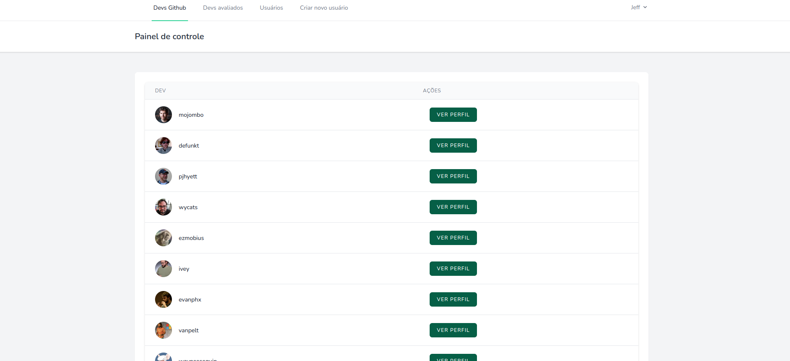
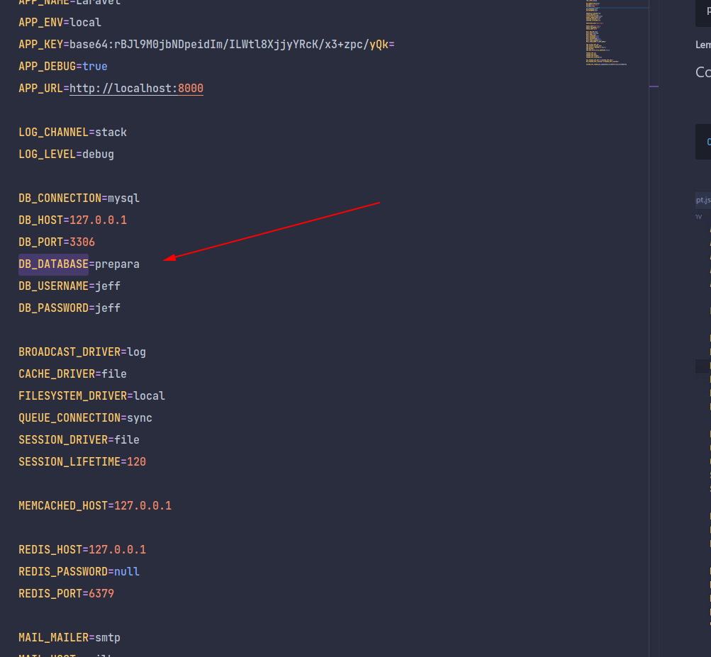
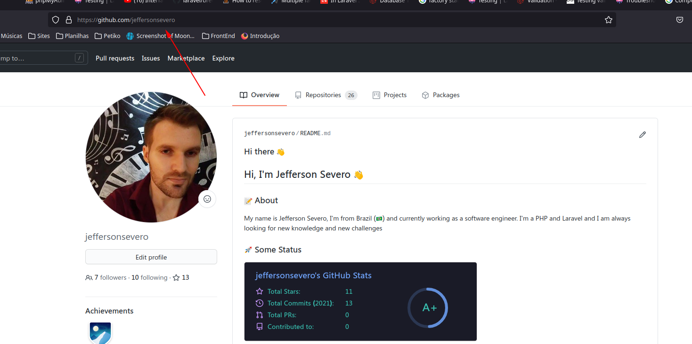

<p align="center"></p>

<p align="center">

<a href="https://packagist.org/packages/laravel/framework"></a>
</p>


## Prévia da aplicação




## Sobre

A empresa prepara todos está em busca de novos desenvolvedores para o seu processo seletivo, e por conta da demanda de filtrar perfis de devs, foi desenvolvido esse sistema para ajudar nesse fluxo. A aplicação basicamente o uso do github para pegar esses perfils de desenvolvedores e apartir disso guardar em sua base os perfils.  Além disso, a aplicação conta com todo um sistema de gerenciamento de usuário, onde o usuário com permissão de administrador, pode criar outros usuários e os gerenciar para ter mais agilidade no processo.

- O usuário admin pode Ver/Cadastrar/Atualizar e apagar outros usuários
- O usuário atendente pede atualizar suas informações
- O usuário admin pode atualizar suas informações
- O usuário atendente pode ver a listagem de devs
- O usuário atendente pode fazer votação no perfil do dev
- Um dev só pode receber uma votação
- A listagem são os 500 primeiros devs do github
- Os perfis disponíveis para voto são RUIM, BOM, MUITO BOM
- Há uma listagem de devs que já receberam votação
- Na listagem de devs que já receberam votação há um filtro por perfil de usuário


## Tecnologias usadas

- [Laravel](https://laravel.com/) -  Versão 8.0
- MySQL
- [Laravel Livewire](https://laravel-livewire.com/docs/2.x/quickstart)
- PHP - Versão 7.3
- [Tailwind CSS](https://tailwindcss.com/)
- [Laravel Breeze](https://github.com/laravel/breeze)


## Pré requisitos

Esse projeto está previsto para ser executado em ambientes UNIX (Linux ou Mac), ficará como trabalho futuro a configuração em ambientes windows.

- Servidor web apache
```bash
$ sudo apt install apache2
```
- Banco de dados MySQL
```bash
$ sudo apt install mysql-server
```
- Composer (Gerenciador de componentes do PHP)
```bash
$ sudo apt install composer
```
- PHP e bibliotecas necessárias
```bash
sudo apt install php libapache2-mod-php php-mbstring php-xmlrpc php-soap php-gd php-xml php-cli php-zip php-bcmath php-tokenizer php-json php-pear
```


**Lembrando que a versão do PHP e de seus pacotes deve ser PHP 7.3+**

## Configuração de banco de dados

- Crie uma base de dados chamada "prepara" sendo com colação de utf_8_general_ci. (Caso esteja em algum interpretador de SQL pode usar o seguinte comando)

```sql
CREATE DATABASE prepara;
```
- Copie o seu arquivo .env.example com o nome de .env
- Configure o seu arquivo .env localizado na raiz do projeto com as suas credenciais de banco de dados




- Depois disso você pode rodar as migrações com o comando 

```bash
php artisan migrate
```

## Configuração do github


- Para autenticar a aplicação no github você deve fornecer seu usuário e token no arquivo .env
- Coloque as duas seguintes variáveis no seu .env e coloque o os dados
```env

GITHUB_API_TOKEN=token
GITHUB_USER=usergithub


```

- O seu user do github é o que tem após github.com




- Para pegar o seu token do github basta seguir esse [link](https://docs.github.com/pt/github/authenticating-to-github/keeping-your-account-and-data-secure/creating-a-personal-access-token)


## Executando o projeto

- Dentro da raiz do projeto, execute o seguinte comando para puxar as dependências composer, caso necessite.

```bash
$ composer install
```

- Ainda dentro da raiz do projeto, execute o seguinte comando para iniciar o servidor da aplicação:


- Agora você pode rodar um seed que vai criar um usuário admin e 10 usuários atendentes: <br>
login admin: admin@gmail.com <br>
senha: 123456

```bash
php artisan db:seed
```

Agora você pode rodar o projeto

```bash
$ php artisan serve
```
- Esse comando irá abrir um servidor em localhost na porta 8000
- Caso você queria abrir em alguma porta de sua preferência execute o seguinte comando
```bash
$ php artisan serve --host localhost:porta
```

## Testes
- O Laravel já vem por padrão equipado com o PHPUnit que é o componente para testes mais conhecido do PHP.
- Para esta aplicação foram feitos alguns testes de integração.
- Estes ficam localizados na pasta tests que fica na raiz do projeto.


- Para rodar os testes execute o seguinte comando na raiz do projeto:
```bash
 $ php artisan test
```


### Autor
---

<a href="github.com/jeffersonsevero">
 
 <br />
 <sub><b>Jefferson C. Severo</b></sub></a> <a href="" title="Rocketseat"></a>


Feito com ❤️ por Jefferson Severo 👋🏽 Entre em contato!

[](https://www.linkedin.com/in/jefferson-severo-83760a152/) 
[](mailto:jeffersonsevero08@gmail.com)


